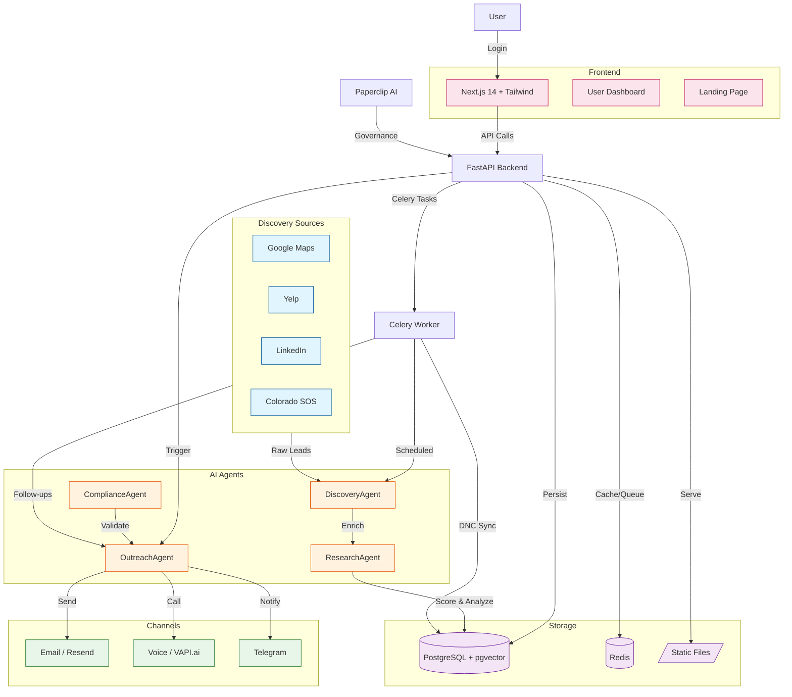

# Eko AI Business Automation

> **Autonomous AI Agents for Prospecting, Outreach, Sales & Deal Closure**  
> Developed by **Eko AI Automation LLC** (Denver, CO)

[](https://github.com/enderjnets/Eko-AI-Business-Automation/actions/workflows/ci.yml)

---

## English

### Overview

Eko AI is a multi-agent sales automation platform built for local businesses. It discovers leads, enriches them with AI-powered research, reaches out via email and voice, and manages the entire pipeline from first contact to closed deal — all with built-in compliance (TCPA, CAN-SPAM, CPA Colorado, FCC AI Rule).

### Architecture

A 6-agent LangGraph system orchestrates the full sales cycle:

| Agent | Function |
|-------|----------|
| **Discovery** | Geo-targeted prospecting (Google Maps, LinkedIn, Yelp, Colorado SOS) |
| **Research** | Lead enrichment with NLP, gap analysis, and dynamic scoring |
| **Outreach** | Multi-channel contact: email, voice AI, SMS |
| **CRM** | Pipeline management, dynamic lead scoring, adaptive follow-ups |
| **Customer Success** | Onboarding, health monitoring, churn prevention |
| **Compliance** | TCPA consent validation, CAN-SPAM unsubscribe, CPA Colorado, FCC AI Rule |


### Architecture Diagram



### Tech Stack

- **Backend**: Python 3.11, FastAPI, LangGraph, SQLAlchemy (async), Celery
- **Frontend**: Next.js 14 (App Router), Tailwind CSS, TanStack Query
- **Database**: PostgreSQL 15 + pgvector
- **Cache / Queue**: Redis
- **AI / LLM**: OpenAI GPT-4o, MiniMax M2.7, Kimi Code
- **Email**: Resend (outbound + inbound webhooks)
- **Voice**: VAPI.ai (outbound + inbound assistant "Eva")
- **Scraping**: Outscraper, Apify, SerpApi
- **Calendar**: Custom booking page with Google Calendar integration
- **Observability**: Paperclip AI (agent governance & audit)

### Quick Start

#### Requirements

- Docker & Docker Compose
- Node.js 20+ (for local frontend development)
- API keys: OpenAI, Resend, Outscraper (see `.env.example`)

#### 1. Clone & configure

```bash
git clone https://github.com/enderjnets/Eko-AI-Business-Automation.git
cd Eko-AI-Business-Automation
cp .env.example .env
# Edit .env with your API keys
```

#### 2. Start services

```bash
docker compose up -d
```

This starts:
- PostgreSQL on `localhost:5432`
- Redis on `localhost:6379`
- Backend API on `http://localhost:8000`
- Frontend on `http://localhost:3001`

#### 3. Verify

```bash
curl http://localhost:8000/health
```

#### 4. Access the dashboard

Open `http://localhost:3001` in your browser.

### API Endpoints

#### Leads
- `GET /api/v1/leads` — List leads
- `POST /api/v1/leads` — Create lead manually
- `GET /api/v1/leads/{id}` — Get lead
- `PATCH /api/v1/leads/{id}` — Update lead
- `POST /api/v1/leads/{id}/enrich` — Enrich with ResearchAgent
- `POST /api/v1/leads/discover` — Run DiscoveryAgent

#### Campaigns
- `GET /api/v1/campaigns` — List campaigns
- `POST /api/v1/campaigns` — Create campaign
- `POST /api/v1/campaigns/{id}/launch` — Launch campaign
- `POST /api/v1/campaigns/{id}/pause` — Pause campaign

#### Emails
- `POST /api/v1/emails/{lead_id}/send` — Send email
- `POST /api/v1/emails/{lead_id}/generate-and-send` — AI-generate and send

#### Voice
- `POST /api/v1/voice-agent/calls` — Place outbound AI call

#### Analytics
- `GET /api/v1/analytics/pipeline` — Pipeline summary
- `GET /api/v1/analytics/performance` — Performance metrics

### Project Structure

```
├── backend/
│   ├── app/
│   │   ├── agents/           # LangGraph agents (Discovery, Research, Outreach, CRM, Compliance)
│   │   ├── api/v1/           # FastAPI routers
│   │   ├── db/               # SQLAlchemy models & migrations
│   │   ├── models/           # Database models
│   │   ├── schemas/          # Pydantic schemas
│   │   ├── services/         # External API integrations (Resend, VAPI, etc.)
│   │   └── tasks/            # Celery background tasks
│   └── tests/
├── frontend/
│   ├── app/                  # Next.js App Router
│   ├── components/           # React components
│   └── lib/                  # API client & utilities
├── docker-compose.yml
└── docs/
```

### Compliance

- **TCPA**: Consent logging, pre-contact validation, DNC registry sync
- **CAN-SPAM**: Functional unsubscribe in every email, opt-out honoring
- **CPA Colorado**: Right to access, deletion, and opt-out
- **FCC AI Rule**: AI disclosure in calls and emails

### License

**Proprietary** — Eko AI Automation LLC. All rights reserved.

---

## Español

### Resumen

Eko AI es una plataforma de automatización de ventas multi-agente construida para negocios locales. Descubre leads, los enriquece con investigación impulsada por IA, contacta por email y voz, y gestiona todo el pipeline desde el primer contacto hasta el cierre — todo con cumplimiento normativo integrado (TCPA, CAN-SPAM, CPA Colorado, FCC AI Rule).

### Arquitectura

Sistema multi-agente construido con **LangGraph** que orquesta todo el ciclo de ventas:

| Agente | Función |
|--------|---------|
| **Discovery** | Prospección geolocalizada (Google Maps, LinkedIn, Yelp, SOS CO) |
| **Research** | Enriquecimiento de leads con NLP y análisis de brechas |
| **Outreach** | Contacto multicanal: email, voz, SMS |
| **CRM** | Pipeline, lead scoring dinámico, seguimiento adaptativo |
| **Customer Success** | Onboarding, monitoreo de salud, prevención de churn |
| **Compliance** | Validación TCPA, CAN-SPAM, CPA Colorado, FCC AI Rule |

### Stack Tecnológico

- **Backend**: Python 3.11, FastAPI, LangGraph, SQLAlchemy, Celery
- **Frontend**: Next.js 14, Tailwind CSS, TanStack Query
- **Database**: PostgreSQL 15 + pgvector
- **Cache/Queue**: Redis
- **LLM**: OpenAI GPT-4o, MiniMax M2.7, Kimi Code
- **Email**: Resend
- **Voz**: VAPI.ai (asistente inbound "Eva")
- **Scraping**: Outscraper, Apify, SerpApi
- **Calendario**: Página de booking propia con integración Google Calendar
- **Gobernanza**: Paperclip AI

### Inicio Rápido

#### Requisitos

- Docker & Docker Compose
- Node.js 20+ (para desarrollo frontend local)
- API keys: OpenAI, Resend, Outscraper (ver `.env.example`)

#### 1. Clonar y configurar

```bash
git clone https://github.com/enderjnets/Eko-AI-Business-Automation.git
cd Eko-AI-Business-Automation
cp .env.example .env
# Editar .env con tus API keys
```

#### 2. Levantar servicios

```bash
docker compose up -d
```

Esto inicia:
- PostgreSQL en `localhost:5432`
- Redis en `localhost:6379`
- Backend API en `http://localhost:8000`
- Frontend en `http://localhost:3001`

#### 3. Verificar

```bash
curl http://localhost:8000/health
```

#### 4. Acceder al dashboard

Abre `http://localhost:3001` en tu navegador.

### Fases de Desarrollo (MVP Rápido)

| Fase | Semana | Entregable |
|------|--------|-----------|
| 1 | 1-2 | Discovery + Research + Dashboard |
| 2 | 3-4 | Email Outreach + CRM Pipeline |
| 3 | 5-6 | Voice AI + Calendar integration |
| 4 | 7-8 | Customer Success + Analytics |
| 5 | 9-10 | Compliance + Production deploy |

### Cumplimiento Normativo

- **TCPA**: Registro de consentimientos, validación previa a contacto, sincronización DNC
- **CAN-SPAM**: Unsubscribe funcional en todos los emails
- **CPA Colorado**: Derecho de acceso, borrado y opt-out
- **FCC AI Rule**: Divulgación de IA en llamadas y emails

### Licencia

**Proprietary** — Eko AI Automation LLC. Todos los derechos reservados.

---

**Contact / Contacto**: eko@ekoai.com | Denver, CO
